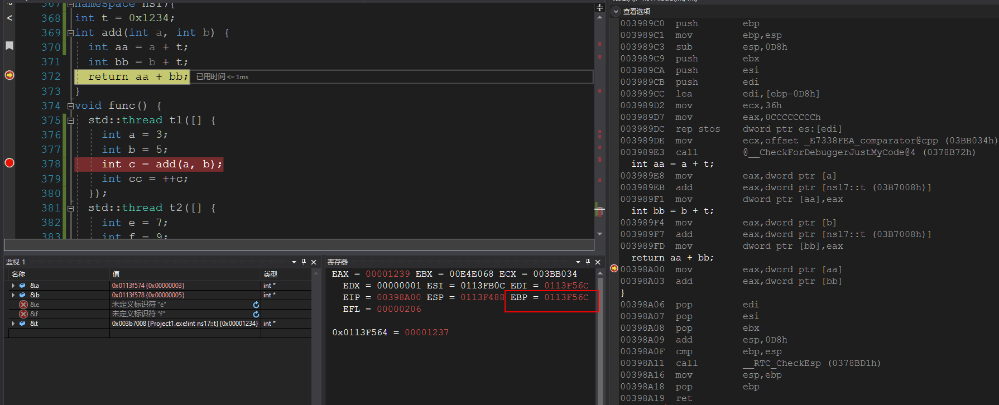
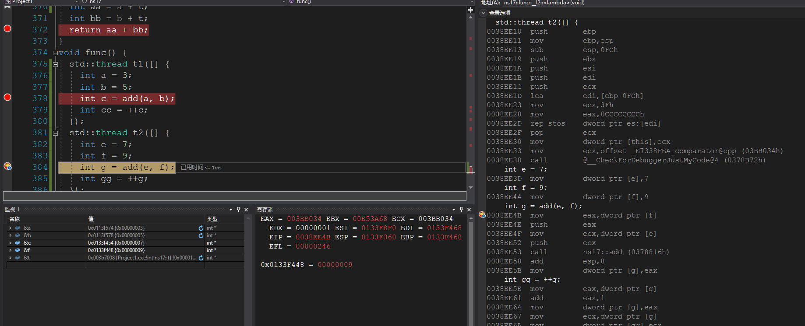
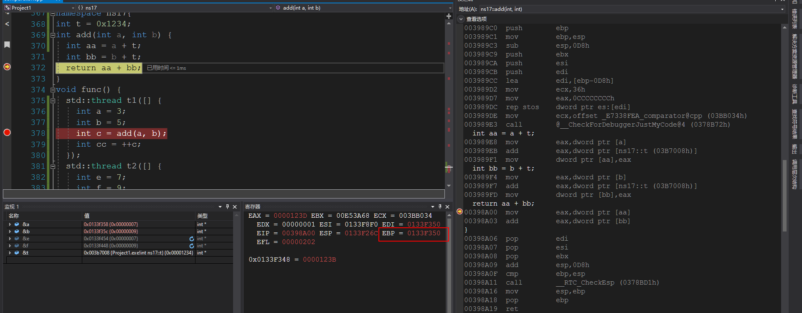
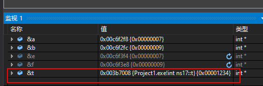
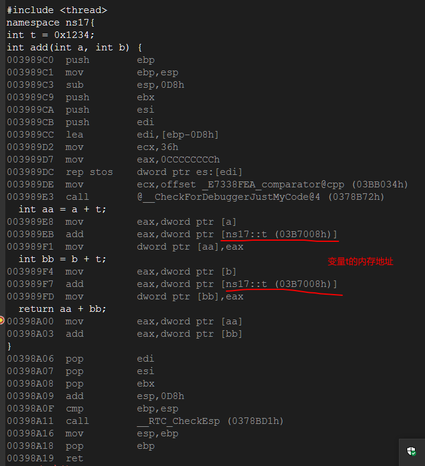

### 为什么多线程进入同一个函数可以保证数据的完整性？

1. 函数调用，就是call目标函数的地址进行执行（见后图，线程1与线程2对函数调用地址是相同的，同时函数的执行地址也是相同的）。
2. 程序执行依赖数据与代码（代码区的数据），数据区存储数据（寄存器，内存（栈区，数据区）），代码负责取出数据负责对其进行处理。
3. 函数调用的栈空间有调用者提供。 入栈的数据包括返回地址，参数，以及被调用函数中的数据，这些栈空间位于调用者的栈空间(依赖EBP,ESP等寄存器进行数据传递)，所以多线程数据互不干扰。

线程1调用前栈明细

线程1调用过程中明细

线程2调用前栈明细

线程2调用过程中明细

4. 若数据非本栈空间的数据，不涉及如本栈空间的操作，比如全局变量，这是多线程访问需要进行数据保护。
    t的内存地址如下
    
    函数调用如下
    

5. 由于代码的位置和数据的位置是独立的，本线程操作的数据只是自己栈空间的数据。